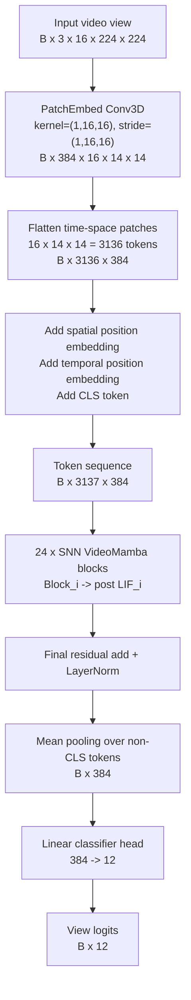
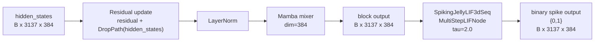
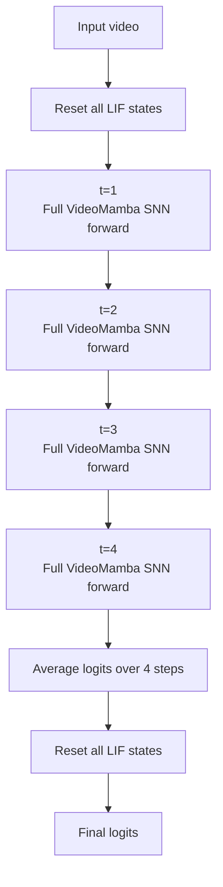
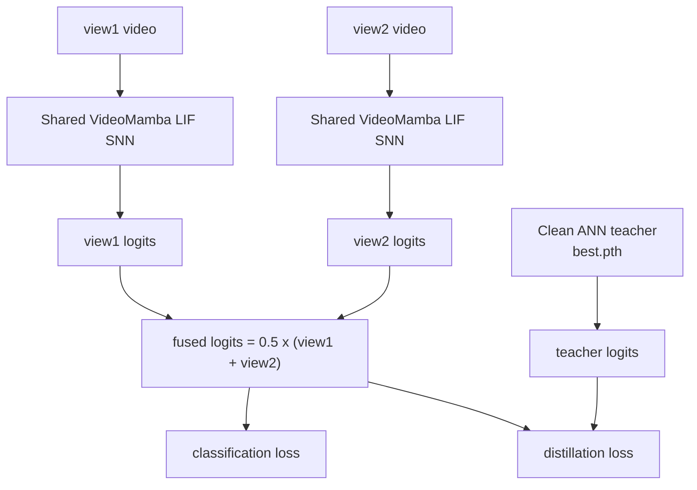
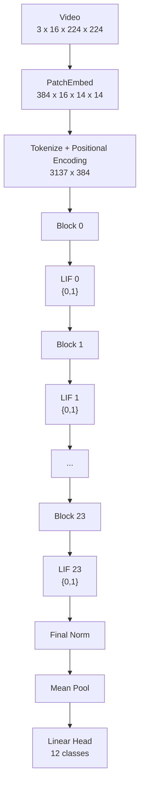

# VideoMamba Unsigned LIF SNN 架构图

更新时间：2026-05-21

本文档描述当前主线模型：

- model: `videomamba_small_trainable_snn`
- base: clean VideoMamba small
- spike layer: `SpikingJellyLIF3dSeq`
- neuron: `MultiStepLIFNode(tau=2.0, detach_reset=True, backend="torch")`
- signed: `False`
- spike output: `{0, 1}`
- spike position: 每个 Mamba block 后面，`post`
- spiked blocks: `0..23`
- patch spike: off
- SNN timesteps: `4`

## 1. 总体结构



当前 full 24-block 模型中，`F` 里每个 block 后都有一个 LIF 脉冲层：

```text
Block 0  -> LIF 0
Block 1  -> LIF 1
...
Block 23 -> LIF 23
```

每个 LIF 输出形状保持不变：

```text
B x 3137 x 384 -> B x 3137 x 384
```

但数值被脉冲化为：

```text
{0, 1}
```

## 2. 单个 SNN Mamba Block

VideoMamba block 内部仍保持原 ANN Mamba 结构，不改 Mamba mixer 本身。脉冲层插在 block 输出后。



注意：

- `LayerNorm` 和 `Mamba mixer` 仍然是浮点计算。
- LIF 只作用在 block 输出的 `hidden_states` 上。
- residual 分支仍由 VideoMamba block 自己维护。
- 当前没有对 `patch_embed` 输出做 spike，`SNN_SPIKE_PATCH=0`。

## 3. SNN 时间步

当前 `SNN_TIMESTEPS=4`。代码逻辑是同一个视频输入重复跑 4 次完整 forward，并在 LIF 内部保留膜电位状态，最后平均 4 次 logits。



代码对应：

```python
steps = max(1, int(self.snn_timesteps))
self.reset_spike_state()
logits_sum = None
for _ in range(steps):
    features = self.forward_features(video)
    logits = self.head(self.head_drop(features))
    logits_sum = logits if logits_sum is None else logits_sum + logits
self.reset_spike_state()
return logits_sum / float(steps)
```

## 4. 双视角训练与推理

训练时使用两个视角视频输入，共享同一个 SNN 模型权重。两个 view 分别 forward 后，logits 做平均融合。



单视角验证时只输入一个 view：

```text
video -> Shared VideoMamba LIF SNN -> logits
```

## 5. 当前 Full 24-Block 训练结果

输出目录：

```text
outputs/videomamba_small_lif_unsigned_snn_b0-1-2-3-4-5-6-7-8-9-10-11-12-13-14-15-16-17-18-19-20-21-22-23_t4_from_b0-11
```

配置：

| item | value |
| --- | --- |
| spike layer | `lif` |
| signed | `False` |
| spike output | `{0,1}` |
| spiked blocks | `0..23` |
| spike position | `post` |
| patch spike | `False` |
| timesteps | `4` |
| init checkpoint | `0..11` best checkpoint |
| teacher | clean ANN best checkpoint |

最新上传结果：

| metric | value |
| --- | --- |
| initial val acc1 | 25.7353 |
| best uploaded val acc1 | 83.0882 |
| best epoch | 3 |
| latest uploaded epoch | 5 |
| latest uploaded val acc1 | 81.6176 |

Spike 统计：

| item | value |
| --- | --- |
| active LIF layers | 24 |
| unique values | `[0.0, 1.0]` |
| nonzero fraction min | 0.1383 |
| nonzero fraction max | 0.4732 |
| nonzero fraction avg | 0.2918 |

## 6. 当前模型简图


